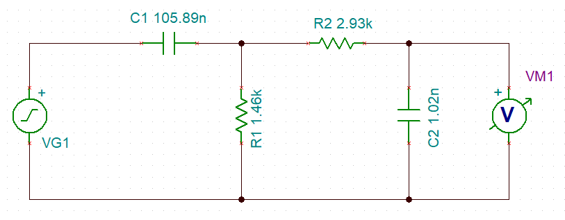
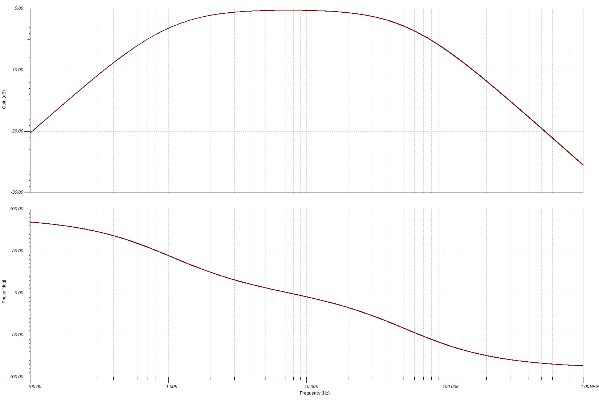
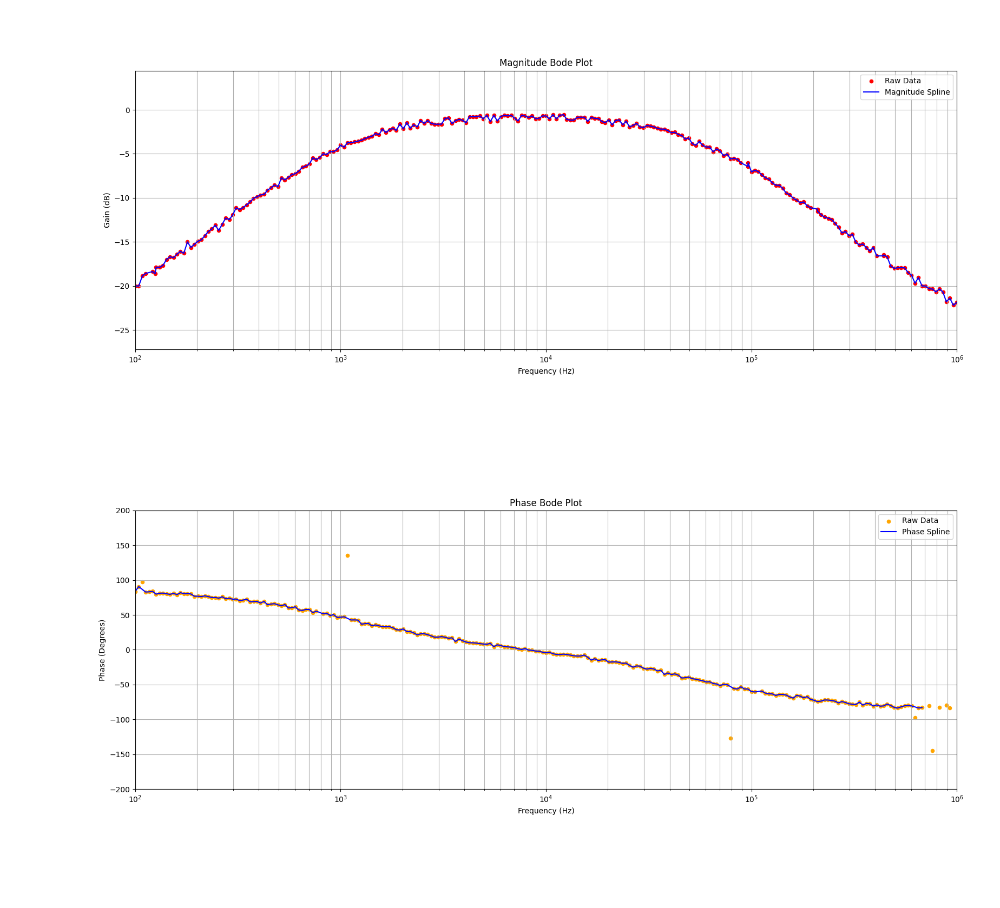

# Frequency Response (Bode Plot)

---

## Table of Contents
1. [Features](#features)
2. [Install on Windows 11](#install-on-windows-11)
3. [Install the .deb Package on Mint Linux (22.1)](#install-the-deb-package-on-mint-linux-221)
4. [Remove the .deb Package on Mint Linux (22.1)](#remove-the-deb-package-on-mint-linux-221)
5. [Build the .deb Package](#build-the-deb-package)
6. [Windows Build Process](#windows-build-process)
7. [Issues](#issues)
8. [Recommended Display](#recommended-display)
9. [Oscilloscope Setup](#oscilloscope-setup)
10. [Software Usage](#software-usage)
11. [Example RC Band Pass Filter Circuit](#example-rc-band-pass-filter-circuit)

---

## Features
1.  **Python Application with Briefcase**:
   - Generate Bode-Plots.
   - Accumulate Peak FFT values.
   - Display oscilloscope.
   - Display X-Y mode or Lissajous patterns.
   - Current implementation uses the OWON HDS320S.
2.  **OWON HDS320S Oscilloscope + Multi-Meter + Waveform Generator**:
   - Bandwidth: 200 MHz, Sample Rate: 1 GS/s.
   - Sine Wave Generator: 0.1 Hz to 30 MHz.
   - Outputs 300 samples from the screen for both channels via SCPI.
3.  **Additional Information**:
   - [OWON HDS300 Series Digital Oscilloscope](https://www.owonna.com/products_owon_hds300_series_digital_oscilloscope)
   - [SCPI Interface for OWON HDS320S](http://files.owon.com.cn/software/Application/HDS200_Series_SCPI_Protocol.pdf)

   **Note**: I experienced minor issues with the kickstand and oscilloscope leads. These were resolved by returning the unit for a replacement.

---

## Install on Windows 11
1. Download `Bode-Plots-0.0.1.msi` and double-click it in File Explorer.
2. Follow the installation prompts: **Next** → **Next** → **Finish**.
3. Open "Bode" from the Windows Start menu.
4. Adjust vertical height as needed.
5. Install drivers for the OWON HDS320S via the provided software or the [Driver Directory](http://files.owon.com.cn/software/PC/HDS300_series_pc_software.zip).

---

## Install the .deb Package on Mint Linux (22.1)
1. Download: `bodeplots_0.0.1-1~linuxmint-xia_amd64.deb`.
2. Open a terminal and run:
   ```bash
   sudo apt install ./bodeplots_0.0.1-1~linuxmint-xia_amd64.deb
   ```

---

## Remove the .deb Package on Mint Linux (22.1)
1. Open a terminal and run:
   ```bash
   sudo apt purge bodeplots
   ```

---

## Build the .deb Package
1. Use Live Mint (22.1) via VirtualBox or a local installation.
2. Download `bodeplots-source-code.tgz`.
3. Follow these steps:
   ```bash
   mkdir BodePlotter-ScopeFFT
   mv ~/Downloads/bodeplots-source-code.tgz BodePlotter-ScopeFFT
   cd BodePlotter-ScopeFFT
   apt update
   sudo apt install python3-virtualenv git
   virtualenv bodeplotter -p python
   source bodeplotter/bin/activate
   pip install --upgrade pip
   pip install briefcase numpy dearpygui matplotlib pyusb scipy screeninfo PyQt5
   tar zpxvf bodeplots-source-code.tgz
   cd bodeplots
   rm -rf build/bodeplots
   briefcase create
   briefcase update -r
   briefcase build
   briefcase package
   ```
   Package file location: `dist/bodeplots_0.0.1-1~linuxmint-xia_amd64.deb`.

---

## Windows Build Process
### Environment Setup for Windows 11
1.  **Install Latest Microsoft Visual C++ Redistributable**:
   - [Documentation](https://learn.microsoft.com/en-gb/cpp/windows/latest-supported-vc-redist?view=msvc-170#latest-microsoft-visual-c-redistributable-version).
   - [Download vc_redist.x64.exe](https://aka.ms/vs/17/release/vc_redist.x64.exe).
2.  **Install Git**:
   - [Git Download Page](https://git-scm.com/downloads/win).
   - [Direct Download](https://github.com/git-for-windows/git/releases/download/v2.48.1.windows.1/Git-2.48.1-64-bit.exe).
3.  Install Python and dependencies via PowerShell:
    ```PowerShell
    mkdir C:\BodePlotter-ScopeFFT
    cd C:\BodePlotter-ScopeFFT
    python -m venv bodeplotter
    .\bodeplotter\Scripts\activate
    pip install --upgrade pip
    pip install briefcase numpy dearpygui matplotlib pyusb scipy screeninfo PyQt5
    ```
4.  Extract source code and build:
    ```PowerShell
    briefcase create windows
    briefcase update windows
    briefcase build windows
    briefcase package windows
    ```
5.  Packaged MSI: `dist\Bode-Plots-0.0.1.msi`.

---

## Issues
1. PhaseDiffProcessor may have sign inconsistencies due to timing mismatches between channels.
2. DearPyGui maximize button doesn't work due to fixed window size constraints.
3. Thin scroll bar in Windows 11 on the Magnitude/Phase Bode Plot window.
4. Matplotlib windows disabled in Windows 11 due to compatibility issues.
5. Install the HDS320S driver on Windows for USB functionality.

---

## Recommended Display
1. 4K Display (4096x2160) preferred; minimum 1600x1200 resolution.
2. VirtualBox with Mint Linux 22.1 works well.

---

## Oscilloscope Setup
1. Connect the oscilloscope to your PC using a USB cable (preferably with Ferrite Rings to reduce noise).
2. Set HDS320S to default:
   - Press **System** → **F3 (Default Setting)** → Confirm.
3. Connect probes:
   - CH1 (yellow lead) to circuit input.
   - CH2 (blue lead) to circuit output.
   - Gen Out to input ground.

---

## Software Usage
1. Launch the software via the command line (`bodeplots`) or from the menu.
2. Verify oscilloscope settings and input desired parameters.
3. Click **Search and Setup DSO** to initialize.
4. Click **Start Measurements** (takes ~10 minutes).
5. After completion, load the JSON log file for playback and analysis.

---

## Example RC Band Pass Filter Circuit

- This example uses a passive RC Band Pass Filter.
- Measured values of the RC band pass filter circuit using the HDS320S multi-meter function:
  - **R1**: Resistance of the lower cutoff resistor = 1.46kΩ
  - **C1**: Capacitance of the lower cutoff capacitor = 105.89nF
  - **R2**: Resistance of the upper cutoff resistor = 2.93kΩ
  - **C2**: Capacitance of the upper cutoff capacitor = 1.02nF

---

### Lower Cutoff Frequency (f1)

```math
f1 = 1 / (2 * π * R1 * C1)

Given:
R1 = 1.46 [kΩ] = 1460 [Ω]
C1 = 105.89 [nF] = 105.89 × 10^-9 [F]

f1 = 1 / (2 * π * 1460 * 105.89 × 10^-9) ≈ 1029.5 [Hz]
```

---

### Upper Cutoff Frequency (f2)

```math
f2 = 1 / (2 * π * R2 * C2)

Given:
R2 = 2.93 [kΩ] = 2930 [Ω]
C2 = 1.02 [nF] = 1.02 × 10^-9 [F]

f2 = 1 / (2 * π * 2930 * 1.02 × 10^-9) ≈ 53.254 [kHz]
```

---

## TINA-TIV9 Simulation of the Circuit

The circuit was simulated using TINA-TIV9 software. Below is the visual representation of the circuit setup:

{style="width:4.09306in;height:1.59583in"}

---

### TINA-TIV9 Simulation Results

The simulation provided the following results, showcasing the circuit's behavior:

{style="width:4.84444in;height:3.23611in"}

---

### Bode Plots Using OWON HDS320S

The Bode plots were generated using the OWON HDS320S oscilloscope in conjunction with the Bode-Plots Python application:

{style="width:5.50625in;height:5.00139in"}


