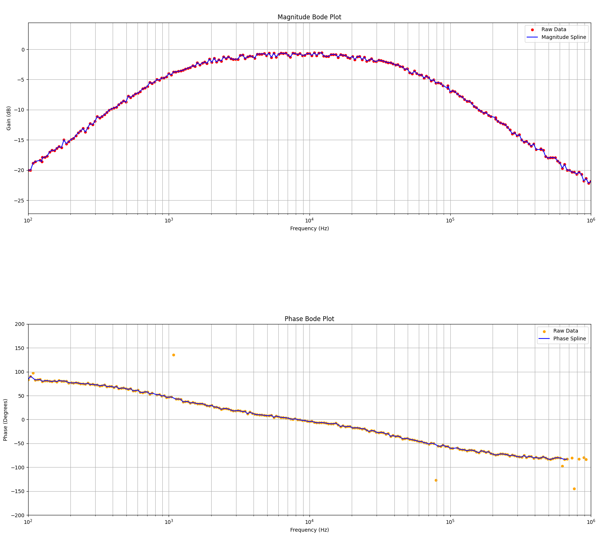
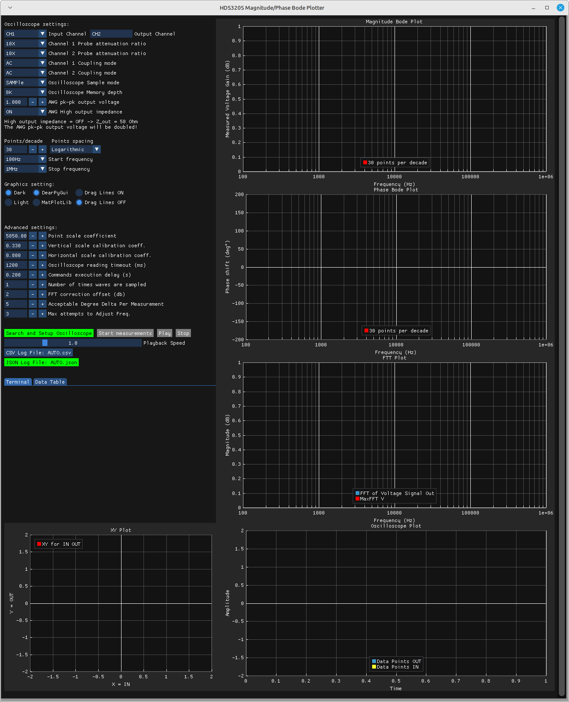
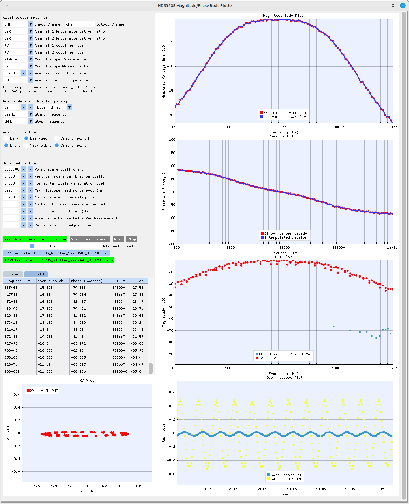
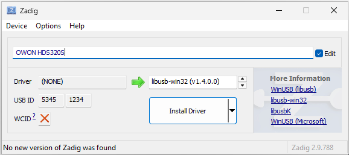

---

## Frequency Response (Bode Plot)

---

For installer downloads and source code, please visit our GitHub Pages site:  
[BodePlotter](https://github.com/BodePlotter/BodePlotter)  
You can also browse the latest releases on GitHub:  
[Releases](https://github.com/BodePlotter/BodePlotter/releases)

---

## Table of Contents
1. [Features](#features)
2. [Example RC Band Pass Filter Circuit](#example-rc-band-pass-filter-circuit)
3. [Screen shots of bodeplots](#screen-shots-of-bodeplots)
4. [Software Usage](#software-usage)
5. [Command Line Options](#command-line-options)
6. [Recommended Display](#recommended-display)
7. [Oscilloscope Setup](#oscilloscope-setup)
8. [Install on Windows 11](#install-on-windows-11)
9. [Install USB Driver for Windows 11](#install-usb-driver-for-windows-11)
10. [Install the .deb Package on Mint Linux (22.1)](#install-the-deb-package-on-mint-linux-221)
11. [Remove the .deb Package on Mint Linux (22.1)](#remove-the-deb-package-on-mint-linux-221)
12. [Build the .deb Package](#build-the-deb-package)
13. [Windows Build Process](#windows-build-process)
14. [Issues](#issues)

---

## Features
### 1. Python Application with Briefcase
- Generates Bode plots.
- Accumulates peak FFT values.
- Displays an oscilloscope view.
- Offers X-Y mode and Lissajous pattern displays.
- Provides alternative plotting using the Matplotlib option for all chart types.
- Displays Smith charts using the Matplotlib option.
- Currently supports the OWON HDS320S (OWON HDS2202S is not tested but uses the same SCPI Interface)

### 2. OWON HDS320S Oscilloscope + Multi-Meter + Waveform Generator
- **Bandwidth:** 200 MHz  
  **Sample Rate:** 1 GS/s.
- **Sine Wave Generator:** 0.1 Hz to 30 MHz.
- Outputs 300 samples per channel from the screen via SCPI.

### 3. Additional Information
- [OWON HDS300 Series Digital Oscilloscope](https://www.owonna.com/products_owon_hds300_series_digital_oscilloscope)
- [SCPI Interface for OWON HDS320S](http://files.owon.com.cn/software/Application/HDS200_Series_SCPI_Protocol.pdf)


---

## Example RC Band Pass Filter Circuit

- This example uses a passive RC Band Pass Filter.
- Measured values of the RC band pass filter circuit using the HDS320S multi-meter function:
  - **R1**: Resistance of the lower cutoff resistor = 1.46kΩ
  - **C1**: Capacitance of the lower cutoff capacitor = 105.89nF
  - **R2**: Resistance of the upper cutoff resistor = 2.93kΩ
  - **C2**: Capacitance of the upper cutoff capacitor = 1.02nF

---

### Lower Cutoff Frequency (f1)

```math
f1 = 1 / (2 * π * R1 * C1)

Given:
R1 = 1.46 [kΩ] = 1460 [Ω]
C1 = 105.89 [nF] = 105.89 × 10^-9 [F]

f1 = 1 / (2 * π * 1460 * 105.89 × 10^-9) ≈ 1029.5 [Hz]
```

---

### Upper Cutoff Frequency (f2)

```math
f2 = 1 / (2 * π * R2 * C2)

Given:
R2 = 2.93 [kΩ] = 2930 [Ω]
C2 = 1.02 [nF] = 1.02 × 10^-9 [F]

f2 = 1 / (2 * π * 2930 * 1.02 × 10^-9) ≈ 53.254 [kHz]
```

---

## TINA-TIV9 Simulation of the Circuit

The circuit was simulated using TINA-TIV9 software. Below is the visual representation of the circuit setup:


---

### TINA-TIV9 Simulation Results

The simulation provided the following results, showcasing the circuit's behavior:


---

### Bode Plots Using OWON HDS320S

The Bode plots were generated using the OWON HDS320S oscilloscope in conjunction with the Bode-Plots Python application:



---

### Screen shots of bodeplots

### HDS320S Magnitude/Phase Bode Plotter window before Measurements or playback



---

### HDS320S Magnitude/Phase Bode Plotter window Playback Dark Theme


---

### HDS320S Magnitude/Phase Bode Plotter window Playback Light Theme



---

### HDS320S Magnitude/Phase Bode Plotter window 1MHz to 10MHz getting into the noise floor


---

### Watch the HDS320S Magnitude/Phase Bode Plotter window and MatPlotLib windows Playback Video

[Watch the HDS320S Magnitude/Phase Bode Plotter window and MatPlotLib windows Video](./media/HDS320S-bode-plots-0.0.5.mp4)

---

## Software Usage
1. Launch the software via the command line (`bodeplots`) or from the menu.
2. Verify oscilloscope settings and input desired parameters.
3. Click **Search and Setup Oscilloscope** to initialize.
4. Click **Start Measurements** (takes about 15 to 30 minutes).
5. After completion, load the JSON log file for playback and analysis.

---

## Command Line Options

- All inputs are used for Windows 11 process spawning except for `--base-port`.
- If the `--base-port` option is not specified, local ports 5001, 5002, 5003, and 5004 will be used to communicate with the Matplotlib windows.

```bash
usage: bodeplots [-h] [--plot-type {XY,MP,FFT,SC,BODEPLOTTER}] 
                      [--start-decade START_DECADE] 
                      [--stop-decade STOP_DECADE] 
                      [--points-per-decade POINTS_PER_DECADE] 
                      [--base-port BASE_PORT] 

BodePlots Application

options:
  -h, --help            show this help message and exit
  --plot-type {XY,MP,FFT,SC,BODEPLOTTER}
                        Select the type of plot to display. Options: XY, MP, FFT, SC, or BODEPLOTTER.
  --start-decade START_DECADE
                        Specify the starting decade for data processing.
  --stop-decade STOP_DECADE
                        Specify the ending decade for data processing.
  --points-per-decade POINTS_PER_DECADE
                        Specify the number of points per decade for the plot.
  --base-port BASE_PORT
                        Specify first IP port for + 0, + 1, + 2, + 3 ports.

````

---

## Recommended Display
1. 4K Display (4096x2160) preferred; minimum 1600x1200 resolution.
2. VirtualBox with Mint Linux 22.1 works well.

---

## Oscilloscope Setup
1. Connect the oscilloscope to your PC using a USB cable (preferably with Ferrite Rings to reduce noise).
2. Set HDS320S to default:
   - Press **System** → **F3 (Default Setting)** → Confirm.
3. Connect probes:
   - CH1 (yellow lead) to circuit input.
   - CH2 (blue lead) to circuit output.
   - Gen Out to input ground.

---

## Install on Windows 11
1. Download [Bode-Plots-0.0.5.msi](https://github.com/BodePlotter/BodePlotter/releases/download/0.0.5/Bode-Plots-0.0.5.msi) and double-click it in File Explorer.
2. Follow the installation prompts: **Next** → **Next** → **Finish**.
3. Open "Bode" from the Windows Start menu.
4. Adjust vertical height as needed.
5. [Install USB Driver for Windows 11](#install-usb-driver-for-windows-11) using Zadig.

---

## Install USB Driver for Windows 11

1. **Download and Install Zadig**  
   Download [zadig-2.9.exe](https://github.com/pbatard/libwdi/releases) to install the drivers for the OWON HDS320S.

2. **Allow Device Changes**  
   When prompted, allow Zadig to change Windows 11 device settings by clicking the **Yes** button.  
   

3. **Allow Updates**  
   When prompted, allow Zadig to check for updates by clicking the **Yes** button.  
   

4. **Detect USB Device**  
   Ensure your HDS320S is plugged in and powered on. Zadig should detect the USB device otherwise select from list.  
   

4. **Detect USB Device**  
   Correctly selected USB device will have USB ID 5345 1234.  
   

5. **Select the Correct Driver**  
   In the driver details, rename the device to **OWON HDS320S**. Then, use the drop-down arrow to select **libusb-win32 (v1.4.0.0)**.  
   

6. **Install the Driver**  
   Click the **Install Driver** button and wait for the installation to complete.  
   

7. **Successful Installation**  
   Zadig should report that the driver was installed successfully.  
   

---

## Install the .deb Package on Mint Linux (22.1)
1. Download: [bodeplots_0.0.5-1~linuxmint-xia_amd64.deb](https://github.com/BodePlotter/BodePlotter/releases/download/0.0.5/bodeplots_0.0.5-1.linuxmint-xia_amd64.deb).
2. Open a terminal and run:
   ```bash
   sudo apt install ./bodeplots_0.0.5-1~linuxmint-xia_amd64.deb
   ```

---

## Remove the .deb Package on Mint Linux (22.1)
1. Open a terminal and run:
   ```bash
   sudo apt purge bodeplots
   ```
---

## Build the .deb Package
1. Use Live Mint (22.1) via VirtualBox or a local installation.
2. Download: [bodeplots-source-code.tgz](https://github.com/BodePlotter/BodePlotter/releases/download/0.0.5/bodeplots-source-code.tgz).
3. Follow these steps:
   ```bash
   mkdir BodePlotter-ScopeFFT
   mv ~/Downloads/bodeplots-source-code.tgz BodePlotter-ScopeFFT
   cd BodePlotter-ScopeFFT
   apt update
   sudo apt install python3-virtualenv git
   virtualenv bodeplotter -p python
   source bodeplotter/bin/activate
   pip install --upgrade pip
   pip install briefcase numpy dearpygui matplotlib pyusb scipy screeninfo PyQt5
   tar zpxvf bodeplots-source-code.tgz
   cd bodeplots
   rm -rf build/bodeplots
   briefcase create
   briefcase update -r
   briefcase build
   briefcase package
   ```
   Package file location: `dist/bodeplots_0.0.5-1~linuxmint-xia_amd64.deb`.

---

## Windows Build Process
### Environment Setup for Windows 11
1.  **Install Latest Microsoft Visual C++ Redistributable**:
   - [Documentation](https://learn.microsoft.com/en-gb/cpp/windows/latest-supported-vc-redist?view=msvc-170#latest-microsoft-visual-c-redistributable-version).
   - [Download vc_redist.x64.exe](https://aka.ms/vs/17/release/vc_redist.x64.exe).
2.  **Install Git**:
   - [Git Download Page](https://git-scm.com/downloads/win).
   - [Direct Download](https://github.com/git-for-windows/git/releases/download/v2.48.1.windows.1/Git-2.48.1-64-bit.exe).
3.  Install Python and dependencies via PowerShell:
    ```PowerShell
    mkdir C:\BodePlotter-ScopeFFT
    cd C:\BodePlotter-ScopeFFT
    python # or https://www.python.org/downloads/release/python-3132/
    # https://www.python.org/ftp/python/3.13.2/python-3.13.2-amd64.exe
    python -m venv bodeplotter
    .\bodeplotter\Scripts\activate
    python.exe -m pip install --upgrade pip
    pip install briefcase numpy dearpygui matplotlib pyusb scipy screeninfo PyQt5
    ```
4.  Extract source code and build: [bodeplots-source-code.tgz](https://github.com/BodePlotter/BodePlotter/releases/download/0.0.5/bodeplots-source-code.tgz)
    ```PowerShell
    cd C:\BodePlotter-ScopeFFT
    .\bodeplotter\Scripts\activate
    cd .\bodeplots
    briefcase create windows app
    briefcase update -r
    briefcase update
    briefcase build -v
    briefcase run -u
    briefcase package windows
    ```
5.  Packaged MSI: `dist\Bode-Plots-0.0.5.msi`.

---

## Issues

1. **Smith Chart Normalization:**  
   - The Smith chart is currently not normalized. When the magnitude for an active filter exceeds 0 dB, the plot area scales dynamically to accommodate the data, causing the rendered chart to extend outside the standard Smith chart boundaries.

2. **Matplotlib Performance on Windows 11:**  
   - On Windows 11, Matplotlib may struggle to keep pace at higher playback speeds:
     - If Matplotlib is selected, starting measurements or playback may exceed 90 seconds before additional windows load.
     - Matplotlib windows are not automatically closed when DearPyGui exits, which can leave log files and temporary files in the user’s TEMP directory. To inspect the TEMP directory, use:
       - **Command Prompt:**
         ```cmd
         explorer %TEMP%
         ```
       - **PowerShell:**
         ```powershell
         explorer $env:TEMP
         ```
     - There is a known issue ([Bug #55 with briefcase-windows-VisualStudio-template](https://github.com/beeware/briefcase-windows-VisualStudio-template/issues/55)) where Matplotlib fails due to I/O handling problems. This arises because the Briefcase logging wrapper does not support managing multiple instances spawned by Matplotlib. (Note: Using Matplotlib within threads makes DearPyGui unstable; therefore, a new process per Matplotlib window is used instead.)
     - **Workaround:**  
       - Using the `console_app` flag in `pyproject.toml` to open a blank console appears to disable logging, which mitigates these issues. An advantage of the console is that you can press CTRL+C to close all Bode-Plots windows.
       - It is recommended to stop active measurements or playback before proceeding, allowing port connections to close gracefully without generating crash dumps.
       - If you would like to hide the console, consider creating a `bode-plots.vbs` script. If you encounter issues with invalid characters, open the file in Notepad++, select **Encoding → Convert to ANSI**, and then save the file. For example:
         ```cmd
         Set WshShell = CreateObject("WScript.Shell")
         WshShell.Run "cmd /c bodeplots.exe", 0, True
         Set WshShell = Nothing
         ```
       - Without the `console_app` flag—allowing for multiple concurrent Matplotlib instances—you can start the application using the following commands:
         ```powershell
         cd C:\BodePlotter-ScopeFFT
         .\bodeplotter\Scripts\activate
         briefcase.exe -v
         cd "$HOME\AppData\Local\Programs\Bode Plotter\Bode-Plots"
         .\Bode-Plots.exe
         ```

---

